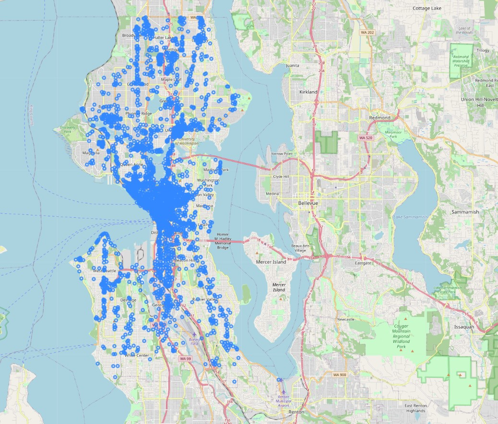

# Model-to-predict-Energy-consumption-City-of-Seattle
Use Seattle's public energy data and build a model predicting energy consumption

The objective of this project is to build a supervised predictive model using energy consumption reports from buildings of the city of Seattle.
The data are available at Kaggle [here](https://www.kaggle.com/city-of-seattle/sea-building-energy-benchmarking?select=socrata_metadata_2016-building-energy-benchmarking.json). The data and additional information can also be found on the [official public website of Seattle's administration](http://www.seattle.gov/environment/climate-change/buildings-and-energy/energy-benchmarking).

# Context
Buildings account for 33% of Seattle's core emissions. The benchmarking policy supports Seattle's goals to reduce energy use and greenhouse gas emissions from existing buildings. In 2013, the City of Seattle adopted a Climate Action Plan to achieve zero net greenhouse gas (GHG) emissions by 2050. Annual benchmarking, reporting and disclosing of building performance are foundational elements of creating more market value for energy efficiency. 

Seattle's Energy Benchmarking Program requires owners of non-residential and multifamily buildings (20,000 sf or larger) to track energy performance and annually report  to the City of Seattle.

# Project structure

A significant part of the project is dedicated to the preparation and cleaning of the raw data so that it can be used by the machine learning algorithms.
Two years of data (2015 & 2016) are compiled.
The steps include:
- Loading and Exploring the datasets
- Harmonize the datasets so that they can be combined
- Develop strategy for missing values
- Decide on the features to keep and those to discard
- Prepare the cleaned dataset for training and testing. Feature engineering.
- Train model and test accuracy
- Observe the most important features. These are the most important features in explaining the target variable (energy consumption).

RandomForest and XGBoost models are trained and achieve over 97% accuracy.
- XGBoost (Extreme Gradient Boosting) belongs to a family of boosting algorithms. Boosting is a sequential technique which works on the principle of an ensemble. It combines a set of weak learners and delivers improved prediction accuracy.
Most important features are total surface area, building year and the number of floors. Building surface is obvious a key driver for energy consumption.
